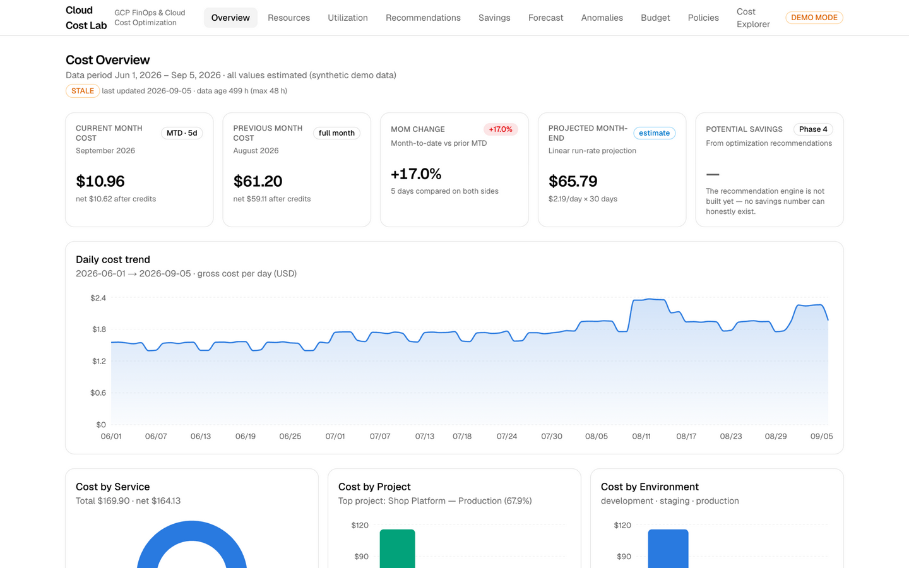
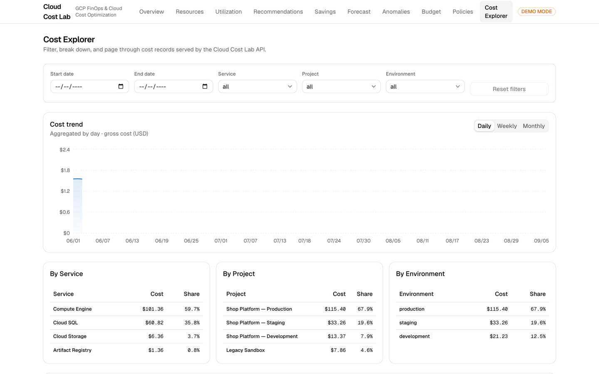
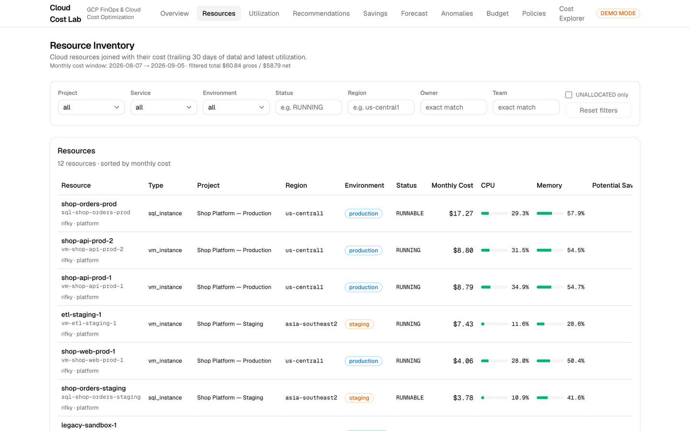
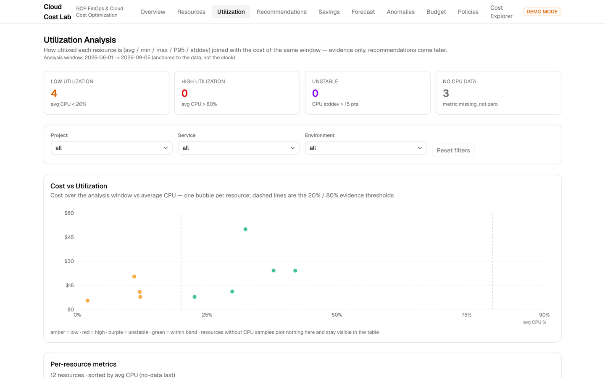
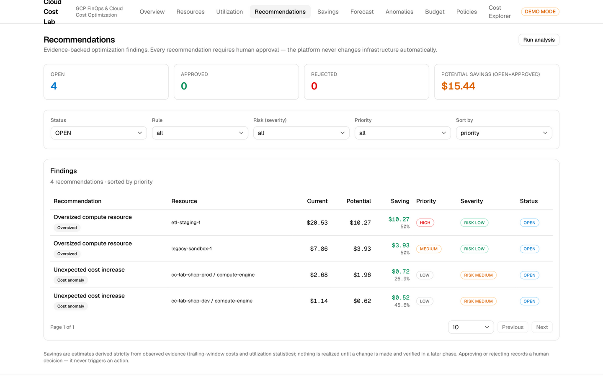
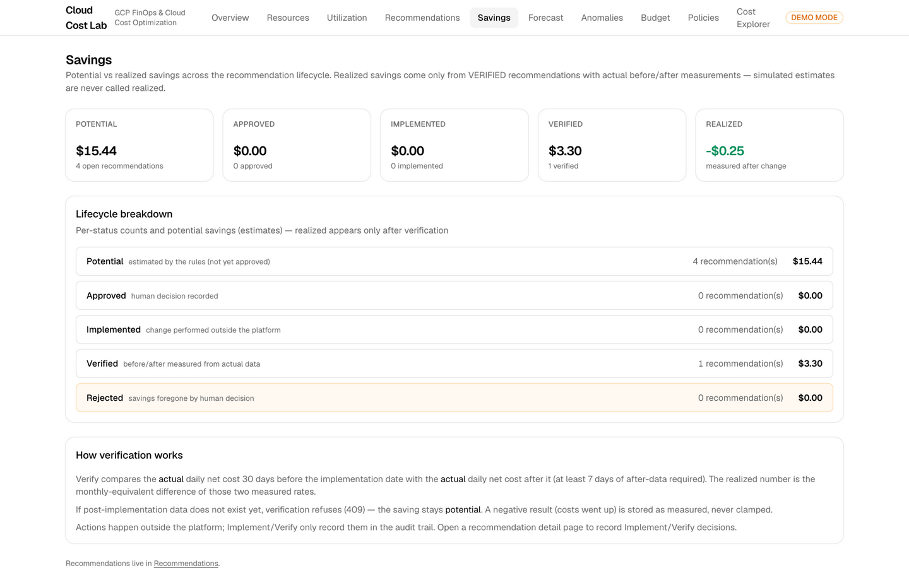
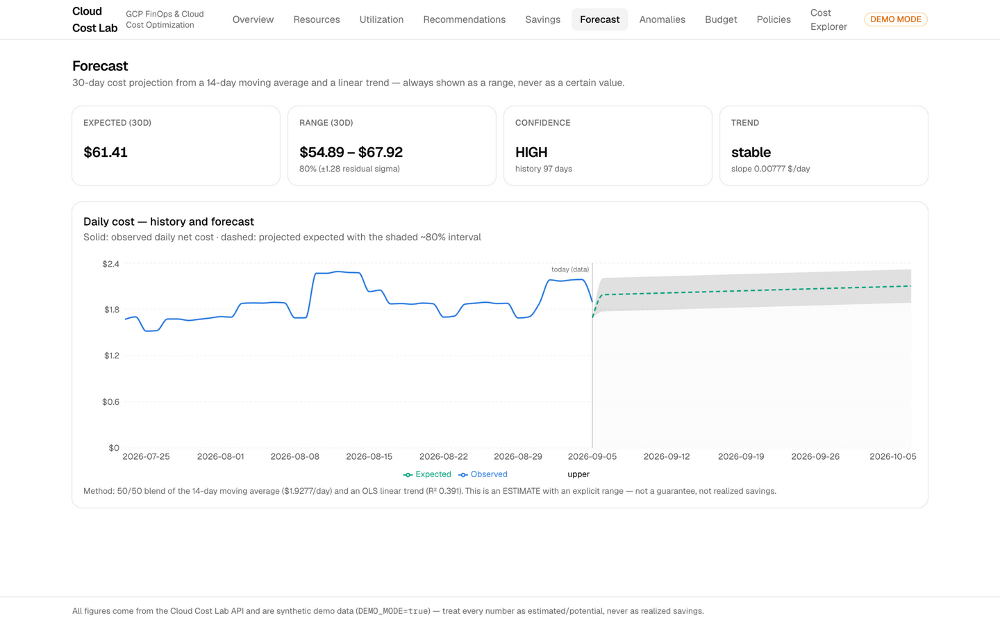
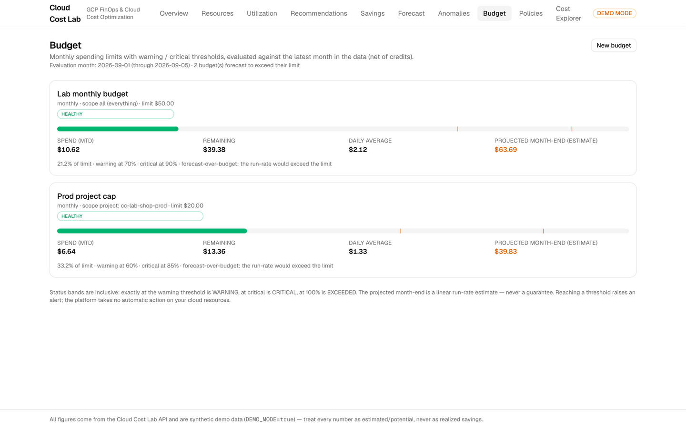

# Cloud Cost Lab

> **GCP FinOps & Cloud Cost Optimization Platform**

Cloud Cost Lab connects cloud **cost** with resource **utilization** and **performance** to answer the questions a cloud console can't: where the money goes, what is idle or oversized, what it might save, and whether those savings were *actually* realized. It forecasts spend with explicit uncertainty, watches budgets, and turns everything into evidence-backed recommendations that require **human approval** — the platform never modifies infrastructure automatically.

**Status:** 16 phases built (planning → portfolio). Demo-first: runs entirely on synthetic data with zero GCP credentials; BigQuery and Cloud Monitoring providers are code-complete and dormant until real data is enabled. Phase detail: [`docs/project-roadmap.md`](docs/project-roadmap.md).

**Quality gates:** 198 backend tests (pytest, strict mypy) · 8 frontend tests (vitest, strict tsc) · ruff + ESLint clean · CI with Gitleaks + Trivy · multi-arch (amd64/arm64) non-root Docker image · Terraform validated (never applied).

---

## 1. Project overview

Cloud Cost Lab is a full-stack FinOps platform built as a deep-skill portfolio project. It implements the complete optimization loop:

1. **Collect** — billing, resource and monitoring data through a provider abstraction (mock today, GCP tomorrow).
2. **Understand** — cost analytics (trends, breakdowns), utilization statistics (avg/min/max/P95/σ), and cost↔utilization↔performance linkage.
3. **Detect** — rule-based recommendation engine (idle, oversized, unused disk, storage retention, cost anomalies) and point-level anomaly detection (rolling baseline + z-score).
4. **Decide** — every recommendation carries evidence, potential savings, risk, confidence and effort; humans approve, reject, implement and verify.
5. **Prove** — realized savings are measured from actual before/after cost data; simulated estimates are never called realized.
6. **Watch** — budgets, governance policies, SLIs/SLOs, alerting, audit trail.

## 2. Problem

Cloud bills are opaque for most engineers:

- Where did the money actually go this month, and why did it change?
- Which resources are idle or overprovisioned — and what **evidence** proves it?
- How much could be saved, and how much **was actually saved** after an optimization?
- Will we exceed the budget before the month ends?
- Which optimization should be done first, and what is the risk?

Consoles show costs; they don't join them to utilization, don't quantify uncertainty, and don't enforce a human approval loop. Cloud Cost Lab is built to answer these questions with data — and to say *"insufficient evidence"* when the data isn't there.

## 3. Architecture

```text
GCP (Billing Export → BigQuery, Cloud Monitoring)   ← dormant; mock data by default
            │
      Data Providers        BillingDataProvider │ MonitoringDataProvider
            │               Mock ⋄ GCP (same contract, ADR-003)
      PostgreSQL (cost database) — migrations via Alembic
            │
      Analytics layer       cost · utilization · recommendations ·
            │               forecasting · anomalies · savings · budget · policies
      Observability         Prometheus /metrics · SLIs/SLOs · alerts · JSON logs
            │
      AI Cloud Cost Advisor (READ-ONLY, pluggable provider)
            │
      Next.js Dashboard     overview · cost · resources · utilization ·
            │               recommendations · savings · forecast · budget · policies
      Human Approval        audit trail · no automatic infrastructure changes
```

## 4. Technology stack

| Layer | Choice | Why |
| --- | --- | --- |
| Frontend | Next.js 15 + TypeScript (strict) + Tailwind + shadcn/ui + Recharts | Dashboard-first, typed API contracts, uniform data states |
| Backend | FastAPI + Python 3.13 + Pydantic + SQLAlchemy + Alembic | Validation at the boundary, testable business logic |
| Database | PostgreSQL 16 | Window functions, JSONB labels, production-realistic |
| Analytics | SQL aggregation + pure Python functions | Averages/P95/z-scores computed in SQL, unit-tested in Python |
| Cloud | GCP (BigQuery, Cloud Monitoring, IAM) | Billing Export + Monitoring are first-class |
| IaC | Terraform (validated, never applied) | Reviewable plan → human decision → apply |
| CI/CD | GitHub Actions | ruff/mypy/pytest · ESLint/tsc/vitest/build · Gitleaks · Trivy · multi-arch Docker |
| AI | Pluggable provider, deterministic offline default | Read-only advisor; LLM optional via env key |

Trade-offs and rejected alternatives: [ADRs](docs/decisions/).

## 5. Demo

Runs with **zero GCP credentials**:

```bash
cp .env.example .env
docker compose up -d                # postgres + api (migrate + seed automatic)
cd apps/web && npm ci && npm run dev
# → http://localhost:3000  (demo dataset: 12 resources, 97 days, ~$170 total)
```

The API exposes 20+ documented endpoints (`/docs` for OpenAPI). Full list in [`docs/architecture.md`](docs/architecture.md).

**5-minute demo flow:** [Dashboard](http://localhost:3000) → Cost Explorer → Resources → Utilization → Recommendations → Savings → Forecast → AI Advisor. Script: [`docs/portfolio/demo-script.md`](docs/portfolio/demo-script.md).

## 6. Screenshots

*(captured live from the running demo stack — `docs/screenshots/`)*

| | |
| --- | --- |
|  |  |
|  |  |
|  |  |
|  |  |

## 7. Cost optimization

The recommendation engine (Phase 5) turns measured evidence into prioritized findings — each with savings math, risk, confidence and effort:

- **IdleComputeRule** — avg CPU < 5%, P95 burst guard, minimal network, ≥ 7 days; dev scheduling saves ~60% of window cost.
- **OversizedComputeRule** — CPU < 20% AND memory < 40% AND stable, one-step-down shape at ~50% cost.
- **UnusedDiskRule / StorageRetentionRule** — detached disks, near-zero-traffic buckets.
- **CostAnomalyRule** — daily cost > 1.3× rolling baseline with absolute noise floors; savings = observed excess.

**Savings verification (Phase 13):** approve → implement → verify compares actual net cost 30 days before vs after the implementation date. The result can be **negative** and is stored as measured. Simulated estimates are never called realized. Full model: [`docs/savings.md`](docs/savings.md).

## 8. FinOps workflow

1. **Visibility** — cost trends, service/project/environment breakdowns, freshness labels (STALE data is never presented as current).
2. **Allocation** — ownership labels; unattributed cost surfaces as **UNALLOCATED**, never guessed.
3. **Optimization** — evidence-backed recommendations with a priority score (savings, confidence, risk, effort).
4. **Governance** — budgets with inclusive warning/critical thresholds; advisory policies (`REQUIRE_OWNER_LABEL`, `MAX_MONTHLY_COST`, `NO_PUBLIC_DATABASE`, …) that report PASS/WARNING/VIOLATION without acting.
5. **Verification** — the potential→realized loop with before/after windows and an append-only audit trail.

## 9. Security

- **Least privilege** — read-only `cost-data-reader` identity; project IAM limited to `bigquery.jobUser`; dataset/bucket-scoped grants only.
- **No secrets in git** — env vars + Secret Manager; `.gitignore` blocks key files; Gitleaks scans every push; Trivy scans code and images (HIGH/CRITICAL fail CI).
- **WIF preferred** over service-account keys for deployment.
- **Prompt-injection defence** in the AI advisor: questions are untrusted data — sanitized, length-capped, screened for instruction-override markers, and refused.
- **AI read-only** (§34/ADR-008): the advisor has no tools and no execution path; every action stays behind the human approval lifecycle.

## 10. SRE

- **Metrics** (`/metrics`): `http_requests_total`, `http_request_duration_seconds`, `billing_records_processed_total`, `billing_data_freshness_seconds`, `recommendations_generated_total`, `forecast_runs_total`, `bigquery_query_duration_seconds`.
- **SLIs/SLOs** (`/api/reliability`): availability ≥ 99.5% · billing freshness < 24h · recommendation success ≥ 99%.
- **Alerts** (`/api/alerts` + [`monitoring/prometheus-rules.yml`](monitoring/prometheus-rules.yml)) linked to runbooks.
- **Incidents** [`docs/incidents/`](docs/incidents/): INC-001…INC-005 with exercised MTTD/MTTR and prevention notes.
- **Runbook** [`docs/runbook.md`](docs/runbook.md): triage + per-alert procedures.
- Structured JSON logs with request-id correlation; STALE data is never presented as current.

## 11. AI Advisor

`POST /api/ai/advisor` answers six cost questions from the platform's structured context and returns the seven-section contract: **Summary, Evidence, Likely Cause, Recommendation, Potential Savings, Risk, Confidence**.

- Pluggable: deterministic offline advisor by default (reproducible, CI-safe); OpenAI-compatible LLM optional via env key.
- Says **"Insufficient evidence"** when the context cannot support an answer — never invents facts or savings.
- Read-only by construction: no tools, no execution path; prompt-injection attempts are refused.

Details and safety model: [`docs/ai-advisor.md`](docs/ai-advisor.md).

## 12. Limitations (honest)

- All data is **synthetic** in demo mode. BigQuery/Monitoring providers are code-complete and tested against stubs, but dormant until real GCP data is enabled manually.
- Terraform is **validated but never applied** — enabling real infrastructure is a documented manual decision.
- Forecasting is a moving-average + linear-trend blend with residual-based bounds — simple by design, not a production time-series system.
- Recommendations are project-specific heuristics with evidence — not guarantees, not FinOps-standard benchmarks.
- The deterministic AI advisor uses keyword intent detection; the optional LLM path returns free-form output labelled "verify before use".
- Realized savings compare run-rates; causal attribution remains a human judgement.
- Single-cloud (GCP) by design; multi-cloud would extend the provider abstraction.

## 13. Future roadmap

- Real GCP enablement (billing export + monitoring) and Cloud Asset Inventory enrichment for resource types.
- Per-team budget/policy overrides; unit economics (cost per request/user); what-if cost simulator.
- Scheduled rollups so utilization aggregates scale beyond one machine.
- Structured parsing of LLM output; richer AI root-cause analysis.
- Multi-cloud providers via the existing abstraction.

---

**Portfolio pack:** [project overview](docs/portfolio/project-overview.md) · [demo script](docs/portfolio/demo-script.md) · [CV description](docs/portfolio/cv-description.md) · [LinkedIn](docs/portfolio/linkedin-description.md) · [interview prep](docs/portfolio/interview-preparation.md)

**License:** MIT · **Author:** Rifky Al Mukmin — 4th-semester informatics student targeting Cloud / DevOps / SRE / FinOps engineering roles.
